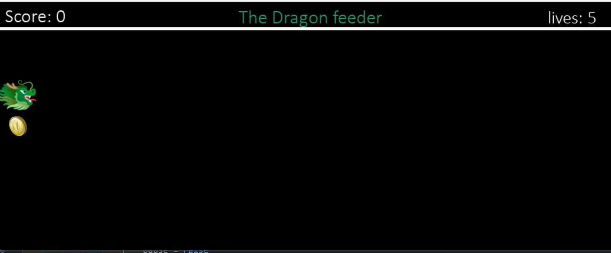

# Feed_The_Dragon

## Description

**"Feed the Dragon!"** is a fun and simple arcade-style game created with Pygame. The player controls a dragon that moves up and down to catch falling coins while avoiding missing them. The goal is to collect as many coins as possible before running out of lives. The game gets progressively harder as the coin speed increases with each successful collection.

## How to Play

1. Run the game by executing the Python script.
2. Use the **Up Arrow (↑)** to move the dragon up.
3. Use the **Down Arrow (↓)** to move the dragon down.
4. **Collect the coins** to increase your score.
5. **Avoid missing coins**, as each miss reduces your lives.
6. The game **ends when you run out of lives**.
7. Press any key to **restart the game** after losing.

## Key Elements of the Game

- **Pygame Library**: Used for game development, handling graphics, and user input.
- **Game Loop**: Runs continuously to update the screen, move objects, and check for collisions.
- **Player Control**: Arrow keys allow the player to move the dragon.
- **Collisions**: Detects when the dragon collects a coin or misses it.
- **Score System**: Tracks the player's score as they collect coins.
- **Increasing Difficulty**: The coin and dragon speed increase as the game progresses.
- **Sound Effects**: Plays sounds for collecting and missing coins.
- **Restart Feature**: Allows the player to restart after losing all lives.

Enjoy playing **Feed the Dragon!** 🐉🔥